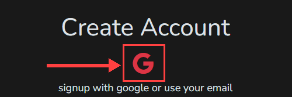

# Create An Account

You can browse the catalog, compare prices and open course demos without an account. You need one to check out and to take a course. If you select **Check Out** in your cart before you have signed up, EduWe asks you to **Sign Up**.

## Sign Up

1. Select **Sign Up** at the top right of any page. On the **Log In** screen, you can also select **Sign Up** under **Welcome, Friend! Create a new Account...**.
2. Choose how to sign up: with your Google account, or with your own details. Both are described below.

<!-- Source: eduwe.io Log In screen. -->
<figure markdown>
  { loading=lazy }
  <figcaption>The Log In screen. Select Sign Up on the right to create an account.</figcaption>
</figure>

## Sign Up With Google

Select the Google icon under **Create Account**. The line under the icon reads "signup with google or use your email".

<figure markdown>
  { loading=lazy }
  <figcaption>Select the Google icon to sign up with your Google account.</figcaption>
</figure>

## Sign Up With Your Own Details

Fill in the form. The numbers match the picture below.

1. **Certificate Print Name.** Enter your name the way you want it printed on your certificate.
2. **Email.**
3. **Mobile Number.**
4. **Enter new Password.**
5. **Confirm your Password.** Enter the same password again.
6. Select **Sign Up**.

<figure markdown>
  { loading=lazy }
  <figcaption>The Create Account form. (1) Certificate Print Name. (2) Email. (3) Mobile Number. (4) New password. (5) Confirm password. (6) Sign Up.</figcaption>
</figure>

## Already Have An Account?

On the left of the Create Account screen, under **Welcome Back! Already have an Account...**, select **Log In**. See [Log in](log-in.md).

<!-- Source: product owner (sign up with Google, or with your own details) and the Create Account screenshot (auth-05-create-account.png). -->
<!-- TODO: confirm whether a verification step follows Sign Up (an email link, or a code sent to your email or mobile number), and what you see next. -->
<!-- TODO: confirm whether you can change your Certificate Print Name later (for example on your Profile page), since it is printed on your certificate. -->
<!-- TODO: document the rules for a new password, the accepted mobile number format, and what happens if the email or mobile number is already registered. -->
<!-- TODO: confirm what signing up with Google asks for (does it still ask for a mobile number and a Certificate Print Name?). -->
<!-- TODO: the Razorpay payment screen shows a mobile number after "Using as". Confirm it is the Mobile Number entered here. -->

## Your Cart

Courses you added to the cart before signing up are kept when you create your account.

<!-- TODO: verify in the app that the anonymous cart survives signup (spec 7.2 says it must); state the behaviour precisely, including what happens if the same course is already in the account cart. -->

## Next Steps

- [Log in](log-in.md) on your next visit.
- [Browse the catalog](../learner/browse-catalog.md).
