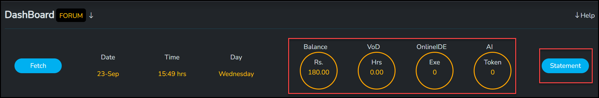
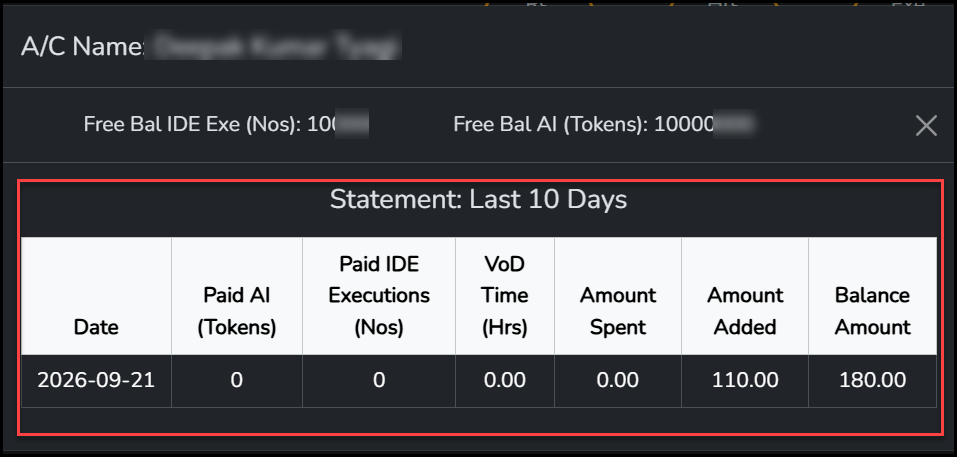
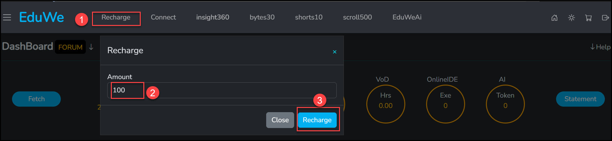
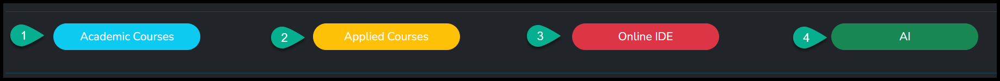
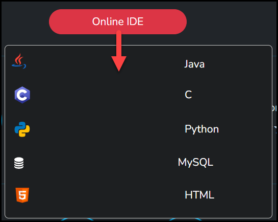
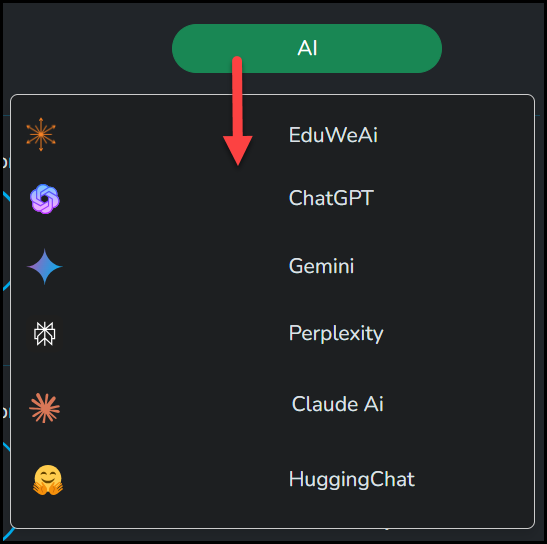
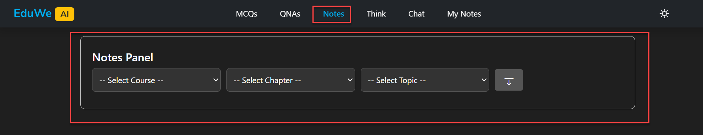
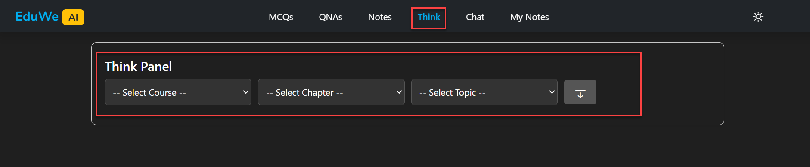
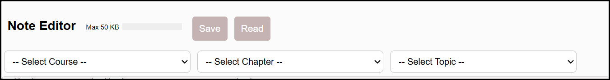

# Your Dashboard

Once you have purchased a course, whether it is an Academic or an Applied course, you land on your Learner Dashboard. From here you can explore the dashboard and start watching and learning your course. See [Taking a course](../learner/taking-a-course.md).

<!-- Source: product owner (after buying an Academic or Applied course you land on the Learner Dashboard, where you explore and start learning). -->
<!-- TODO: confirm whether logging in also lands you on the dashboard, and how to open a course and start watching from its row. -->

<figure markdown>
  { loading=lazy }
  <figcaption>The learner dashboard. The red box outlines one course row.</figcaption>
</figure>

## The Top Bar

On the left are the menu icon, the EduWe logo and these links: **Recharge**, **Connect**, **insight360**, **bytes30**, **shorts10**, **scroll500** and **EduWeAi**. On the right are the home, theme and cart icons and one more icon at the far right, which looks the same as the icon beside **LogOut** in the side menu.

**Connect** opens a window where you can register a complaint with the EduWe support team. See [Contact](../support/contact.md).

<figure markdown>
  { loading=lazy }
  <figcaption>The Connect window, opened from the Connect link in the top bar.</figcaption>
</figure>

Select the menu icon to open the side menu. It has your photo and name, which open your Profile page, and the groups Courses, Services, Accounts, Purchase, Query and SetUp, with Forum and LogOut at the bottom. See [Profile and settings](../learner/profile-and-settings.md).

Under the top bar, the **DashBoard** title has a **FORUM** button beside it, and there is a **Help** menu on the right.

## Recharge Balance Summary

A row under the title shows the current date, time and day, with a **Fetch** button on the left and a **Statement** button on the right. In between are four counters, all funded by the money you [recharge](#recharge-your-account):

- **Balance**, your recharge balance, in rupees (Rs.).
- **VoD**, in hours (Hrs). Watching a video in an On Demand course counts against this, and your Balance reduces accordingly.
- **OnlineIDE**, in executions (Exe). Using an IDE tool - Java, C, Python and so on - counts against this based on how long your code runs, and your Balance reduces accordingly.
- **AI**, in tokens (Token). Using EduWeAi, anywhere you use it, counts against this, and your Balance reduces accordingly.

Once your recharge amount is exhausted, [recharge your account](#recharge-your-account) again to keep using these features.

The eduwe.io FAQ says your dashboard shows real-time usage and spend.

<figure markdown>
  { loading=lazy }
  <figcaption>The summary row, with the Statement button on the right.</figcaption>
</figure>

Select **Statement** to see your usage and spend. The window opens with your account name, your free balances (**Free Bal IDE Exe (Nos)** and **Free Bal AI (Tokens)**), and a **Statement: Last 10 Days** table with one row per day: **Date**, **Paid AI (Tokens)**, **Paid IDE Executions (Nos)**, **VoD Time (Hrs)**, **Amount Spent**, **Amount Added** and **Balance Amount**.

<figure markdown>
  { loading=lazy }
  <figcaption>The Statement window, opened from the Statement button.</figcaption>
</figure>

<!-- Source: product owner (VoD counts hours watched in On Demand courses, OnlineIDE counts execution time, AI counts EduWeAi usage anywhere, and all three draw down the recharge Balance until it needs recharging again) and the Statement window screenshots (dashboard-09, dashboard-10). -->
<!-- TODO: confirm what Fetch does. -->
<!-- TODO: confirm exactly how rupees convert to VoD hours, IDE executions and AI tokens (a fixed rate, or set per feature). -->

Below the counters are four buttons that filter your course list or open a tool. See [Filters and tools](#filters-and-tools).

## Recharge Your Account

To recharge your account:

1. Select **Recharge** in the top bar of the dashboard. The **Recharge** window opens.
2. Enter the **Amount**. The minimum is Rs. 100.
3. Select **Recharge**.

To leave the window without recharging, select **Close**.

The money you recharge is used for On Demand courses. **EduWeAi** also uses this money to give you AI tokens.

<figure markdown>
  { loading=lazy }
  <figcaption>The Recharge window. (1) The Recharge link. (2) The amount, at least Rs. 100. (3) The Recharge button.</figcaption>
</figure>

<!-- Source: product owner (recharge steps, the Rs. 100 minimum, and that the recharge is used in On Demand and by EduWeAi to give tokens) and the Recharge window screenshot (dashboard-08-recharge.png). -->
<!-- TODO: confirm what happens after you select Recharge (payment through Razorpay, as in checkout?), how quickly the Balance counter updates, and whether a receipt is issued. -->
<!-- TODO: confirm whether there is a maximum amount and whether the balance expires. Also confirm whether the balance pays for anything else, such as video hours (VoD) or Online IDE executions, how many AI tokens a rupee buys, and how On Demand courses use up the balance. -->

## Filters And Tools

Four buttons sit under the counters.

<figure markdown>
  { loading=lazy }
  <figcaption>The filter and tool buttons.</figcaption>
</figure>

1. **Academic Courses** shows only your Academic courses.
2. **Applied Courses** shows only your Applied courses.
3. **Online IDE** is the online compiler, where you can run your code for your courses. Select it to choose a language.
4. **AI** opens a list of AI tools. **EduWeAi** is the EduWeAi tool, which helps learners in various ways. It uses the money you recharge to give you AI tokens.

**3. Online IDE.** Select **Online IDE** and choose a language from the list: **Java**, **C**, **Python**, **MySQL** or **HTML**.

<figure markdown>
  { loading=lazy }
  <figcaption>The Online IDE menu.</figcaption>
</figure>

For example, if you choose **C**, the **EduWe Code Sathi** compiler opens with the C logo at the top right. Write your code in the editor on the left and select **Run**. The result appears in the panel on the right, followed by a message that the code executed successfully.

<figure markdown>
  { loading=lazy }
  <figcaption>The C compiler with a Hello World program and its output.</figcaption>
</figure>

**4. AI.** Select **AI** and choose a tool from the list: **EduWeAi**, **ChatGPT**, **Gemini**, **Perplexity**, **Claude Ai** or **HuggingChat**.

<figure markdown>
  { loading=lazy }
  <figcaption>The AI menu.</figcaption>
</figure>

If you choose **EduWeAi**, the EduWeAi page opens. Its top bar has six tabs: **MCQs**, **QNAs**, **Notes**, **Think**, **Chat** and **My Notes**. The example shows the **MCQs Panel**, where you choose a course, a chapter and a topic, and set the difficulty level, applicability and mode. See [EduWeAi](#eduweai) for each tab.

<figure markdown>
  { loading=lazy }
  <figcaption>The EduWeAi page, showing the MCQs Panel. The red box outlines the six tabs.</figcaption>
</figure>

<!-- Source: product owner (button behaviour), dashboard-05-filters-and-tools.png, dashboard-06-online-ide-menu.png, dashboard-07-ai-menu.png, ide-01-c-compiler.png and ai-01-eduweai-mcqs-panel.png. -->
<!-- TODO: confirm how to clear a filter and see all your courses again (select the button again, or another control). -->
<!-- TODO: confirm the EduWeAi link in the top bar opens the same EduWeAi page. -->
<!-- TODO: confirm what the other tools in the AI list do when selected (open their own websites, or work inside EduWe), and whether learners need their own accounts with them. -->
<!-- TODO: confirm whether the compiler opens in a new window, and whether more languages are planned. -->
<!-- TODO: explain the compiler toolbar icons (the icons left of Run, the Ai-tagged bug icon, the binoculars, the chat bubble and the close icon), how to give input to a program, and whether your code is saved. -->
<!-- TODO: document how the other languages look, especially MySQL and HTML (do they show a query result or a page preview instead of console output?). -->
<!-- TODO: confirm whether Online IDE uses the OnlineIDE (Exe) counter, whether the other AI tools are metered at all, how EduWeAi tokens are used up, and what happens when a counter reaches 0. -->

## Your Courses

Every course you bought has its own row. A row shows:

- the course picture with its course code (for example JAV) and title,
- **Start-Date** and **End-Date**, which show when your access starts and ends (one year for a Fully Paid course),
- the **Course Type**, which is On Demand or Fully Paid, and whether the course is Academic or Applied,
- three progress circles: **TYS**, **MCQ** and **Certification**,
- your **Performance**, shown as stars,
- your **Course Rating**, with up and down arrows.

See [Certificates](../learner/certificates.md) for how TYS, MCQ and certification work.

### An Example Course Row

This row is a Fully Paid course, Cloud Computing, where the learner has started the TYS questions.

<figure markdown>
  { loading=lazy }
  <figcaption>A course row. TYS is 21.67% attempted, MCQ is 0%, and the learner has rated the course 5.</figcaption>
</figure>

### TYS And MCQ: What You Have Attempted

The **TYS** and **MCQ** circles show the percentage of each that you have attempted. In the example, 21.67% of the TYS has been attempted, and the MCQ circle shows 0% because none have been attempted yet. The ring fills as you attempt more.

### Course Rating: Your Own Rating

**Course Rating** is your own rating of the course. It is given by you, the learner. Use the up and down arrows to change it. The number between the arrows is the rating you have given, which is 5 in the example. The scale runs from 1 (lowest) to 5 (highest). Your rating saves instantly, and you can change it again later whenever you like.

<!-- Source: product owner (TYS and MCQ circles show the attempted percentage; Course Rating is given by the learner, from 1 lowest to 5 highest, saves instantly and can be edited again later) and the dashboard-03-course-row.png screenshot. -->
<!-- TODO: confirm whether instructors or other learners see your Course Rating. -->
<!-- TODO: the first dashboard screenshot shows a course with only the arrows and no number between them. Confirm that this means you have not rated the course yet. -->
<!-- TODO: explain the Certification circle (0.00% here) and the Performance stars. -->
<!-- TODO: confirm whether TYS is the Test Yourself questions and whether the circle counts questions or sections attempted. -->

<!-- Source: eduwe.io learner dashboard screenshot (dashboard-01-learner-dashboard.png) and FAQ "How does pricing work?". -->
<!-- TODO: explain the FORUM button and the Help menu. There is already a Help menu here, so decide how it should work alongside the new ? help button. -->
<!-- TODO: confirm that the icon at the far right of the top bar logs you out (it matches the LogOut icon in the side menu). -->
<!-- TODO: the Fully Paid example spans exactly one year (01-Sep-26 to 01-Sep-27), which matches the one-year rule. The On Demand example also spans one year; confirm the On Demand access period. -->
<!-- TODO: add a dashboard screenshot with a Fully Paid course and one with progress, to show the circles filling in. -->

## EduWeAi

Select **AI** and then **EduWeAi** to open EduWeAi. The eduwe.io home page describes it as AI-assisted notes, topic chat and on-demand MCQs. It uses the money you recharge to give you AI tokens. See [Recharge your account](#recharge-your-account).

The MCQs, QNAs, Notes, Think and Chat tabs all start with the same three lists: **Select Course**, **Select Chapter** and **Select Topic**.

### MCQs

Use the **MCQs** tab to generate MCQs for the course, chapter, topic or subtopic you select. Once the MCQs are generated, you can save them to your own database, so you can open them again next time.

The **MCQs Panel** has the three lists above, and then **Difficulty Level**, **Applicability** and **Mode**, with a download button, a **Save** button and a database button.

<figure markdown>
  { loading=lazy }
  <figcaption>The MCQs tab and its panel.</figcaption>
</figure>

<!-- Source: product owner (learners generate MCQs for a course, chapter, topic or subtopic, and can save them to their own database for next time) and the MCQs Panel screenshot (ai-06-mcqs-panel.png). -->
<!-- TODO: the panel shows lists for course, chapter and topic. Confirm where the subtopic is chosen. -->
<!-- TODO: confirm what "save after selection" means: do you pick the MCQs you want to keep and then select Save, or does Save keep the whole set? Also confirm what the database button does (does it open your saved MCQs?) and what the download button does. -->
<!-- TODO: confirm how many MCQs are generated at a time, whether the Difficulty Level, Applicability and Mode choices are the same as for QNAs, whether generating MCQs uses AI tokens, and where saved MCQs are found later. -->

### QNAs

Use the **QNAs** tab to generate questions and answers for the course, chapter, topic or subtopic you select. You can also choose:

- **Difficulty Level:** easy, medium or hard.
- **Applicability:** mathematical, conceptual, applied or code based.
- **Mode:** exam, interview or competitive.

Once the QNAs are generated, you can save them to your own database, so you can open them again next time.

The **QNAs Panel** has the same lists and buttons as the MCQs Panel.

<figure markdown>
  { loading=lazy }
  <figcaption>The QNAs tab and its panel.</figcaption>
</figure>

<!-- Source: product owner (QNAs are generated for a course, chapter, topic or subtopic, with the difficulty, applicability and mode choices above, and can be saved to the learner's own database for next time) and the QNAs Panel screenshot (ai-02-qnas-panel.png). -->
<!-- TODO: confirm the exact labels in the Difficulty Level, Applicability and Mode dropdowns (the choices above are written as plain words). -->
<!-- TODO: confirm how many questions are generated at a time, whether generating QNAs uses AI tokens, and where saved QNAs are found later. Same questions as for MCQs about "save after selection" and the download and database buttons. -->

### Notes

Use the **Notes** tab to generate your own notes for the course, chapter and topic you select.

The **Notes Panel** has the three lists and a download button.

<figure markdown>
  { loading=lazy }
  <figcaption>The Notes tab and its panel.</figcaption>
</figure>

<!-- Source: product owner (learners generate their own notes for the selected course, chapter and topic) and the Notes Panel screenshot (ai-03-notes-panel.png). -->
<!-- TODO: the Notes Panel has no Save button, unlike the MCQs and QNAs panels. My Notes shows saved notes, so confirm how a note generated on the Notes tab gets saved there (there is no Save button on the Notes Panel), and what the download button does. -->
<!-- TODO: confirm whether you can choose a subtopic, the length or style of the notes, and whether generating notes uses AI tokens. -->

### Think

Use the **Think** tab to get answers for the course, chapter and topic you select, in the style of "Think Like an Engineer".

The **Think Panel** has the three lists and a download button.

<figure markdown>
  { loading=lazy }
  <figcaption>The Think tab and its panel.</figcaption>
</figure>

<!-- Source: product owner (Think gives answers for the selected course, chapter and topic as "Think Like an Engineer") and the Think Panel screenshot (ai-04-think-panel.png). -->
<!-- TODO: the Think Panel has no question box. Confirm how an answer is produced (after you choose a topic, or with the button), what the download button does, and add a screenshot of an answer. -->
<!-- TODO: explain what "Think Like an Engineer" means for the learner, with one short example, and confirm whether Think uses AI tokens. -->

### Chat

Use **Chat** to chat with EduWeAi about the course, chapter and topic you select. You can ask any question that falls within the boundaries of the course. The numbers match the picture.

1. Open the **Chat** tab.
2. Choose a course.
3. Choose a chapter.
4. Choose a topic.
5. Select **New Chat** at the left to start a new chat.
6. Type your question in the **Type your message...** box.

<figure markdown>
  { loading=lazy }
  <figcaption>The Chat tab. (1) Chat. (2) Course. (3) Chapter. (4) Topic. (5) New Chat. (6) Message box.</figcaption>
</figure>

### My Notes

Use **My Notes** to write, store and read your own notes as you go. The page is a **Note Editor**.

1. Open the **My Notes** tab.
2. Choose a course, a chapter and a topic to file the note under.
3. Write the note (it has a formatting toolbar and a **Max 50 KB** limit) and select **Save**, or select **Read** to open a note you saved earlier.

The same Note Editor also opens from inside a course, on its own **My Notes** tab. See [Taking a course: My Notes](../learner/taking-a-course.md#my-notes).

<figure markdown>
  { loading=lazy }
  <figcaption>The My Notes tab, the Note Editor.</figcaption>
</figure>

<!-- Source: eduwe.io EduWeAi screenshots (ai-01 to ai-07), and the eduwe.io home page for the description of AI-assisted notes, topic chat and on-demand MCQs. -->
<!-- TODO: explain how Think answers differ from Notes. -->
<!-- TODO: explain the download, Save and database buttons, and confirm the option lists for Difficulty Level, Applicability and Mode on every tab that has them. -->
<!-- Source: product owner (Chat works on the selected course, chapter and topic, and you can ask any question related to the course boundaries). -->
<!-- TODO: Chat: confirm what EduWeAi answers when a question is outside the course boundaries, and whether a chat uses AI tokens. -->
<!-- TODO: Chat: what mark 7 (the grey box at the bottom left of the page) is, how a chat is sent (Enter key or a button), what the menu icon at the top left does (show or hide your chats?), and whether a chat is saved. -->
<!-- Source: product owner (learners can access and read their saved notes in My Notes) and the Note Editor screenshot (ai-07-my-notes-editor.png). -->
<!-- TODO: confirm the order of the steps (do you choose the course, chapter and topic first, and does Read then open the note?), why Save and Read look greyed out (until a topic is chosen?), and what the bar next to Max 50 KB shows. -->
<!-- TODO: the screenshot is cropped at the bottom and shows part of a toolbar. Capture the whole Note Editor, including the writing area and the toolbar, and explain how to write and edit a note. -->
<!-- TODO: confirm what happens when a note reaches 50 KB. -->
<!-- TODO: explain how tokens are used by each tab, what a learner sees when tokens run out, and how to buy more (Recharge). -->

Related: [My courses](../learner/my-courses.md), [Fully Paid vs On Demand](../learner/pricing-models.md).
