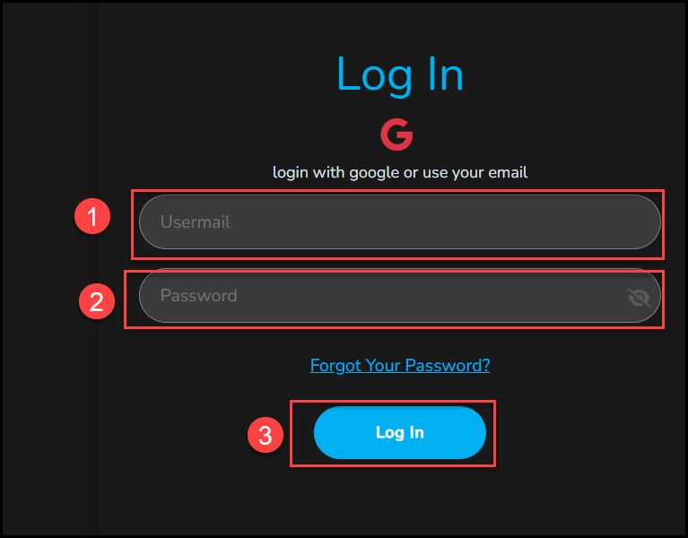
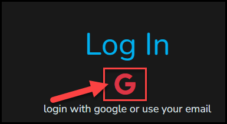

# Log In

Select **Log In** at the top right of any page. You also reach the same screen when you select **Check Out** in your cart before you have logged in.

## Log In With Your Email

1. Enter your email in the **Usermail** field.
2. Enter your **Password**. Select the eye icon in the field to show or hide it.
3. Select **Log In**.

<figure markdown>
  { loading=lazy }
  <figcaption>Log in with your email. (1) Usermail. (2) Password. (3) Log In.</figcaption>
</figure>

## Log In With Google

Select the Google icon (the red **G**) under **Log In** to use your Google account. The line under the icon reads "login with google or use your email".

<figure markdown>
  { loading=lazy }
  <figcaption>Select the Google icon to log in with your Google account.</figcaption>
</figure>

## Forgot Your Password?

Select **Forgot Your Password?** below the password field. The **Reset Password** screen opens.

1. Enter your email.
2. Enter a new password.
3. Enter the new password again in **Confirm your Password**.
4. Select **Reset**.

The panel on the left says **Welcome Back!** and **Login after password reset...**. When your password has been reset, select **Log In** there and log in with your new password.

<figure markdown>
  { loading=lazy }
  <figcaption>The Reset Password screen. (1) Email. (2) New password. (3) Confirm password. (4) Reset.</figcaption>
</figure>

## No Account Yet?

On the right of the screen, under **Welcome, Friend! Create a new Account...**, select **Sign Up**. See [Create an account](create-account.md).

<!-- Source: eduwe.io Log In screen (shown from Check Out). -->
<figure markdown>
  { loading=lazy }
  <figcaption>The Log In screen. Log in on the left, or select Sign Up on the right to create an account.</figcaption>
</figure>

<!-- TODO: confirm the exact label of the email field ("Usermail" on the screen) and that the eye icon shows and hides the password. -->
<!-- TODO: confirm what the Google icon does for someone with no account yet (log in, or create an account). -->
<!-- Source: eduwe.io Reset Password screen (auth-04-reset-password.png). -->
<!-- TODO: confirm how you reach the Reset Password screen from Forgot Your Password? (directly, or through an emailed link or a code), and what message you see after you select Reset. -->
<!-- TODO: document the rules for a new password (minimum length, characters), what happens if the email is not registered or the account was created with Google, and any lockout rules. -->
<!-- Source: the Log In screen opened from the header button says "login with google or use your email". The same screen opened from Check Out says "checkout with google or use your email" under a Check Out subtitle. -->

If you cannot log in, see [Troubleshooting](../support/troubleshooting.md).
