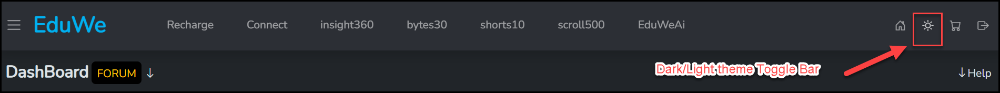

# Themes And Display

## Light And Dark Theme

Use the theme toggle in the top bar to switch between the dark and light themes.

1. Find the sun icon in the top bar. On your dashboard it sits between the home icon and the cart icon. On the home page it is next to the cart icon.
2. Select it to switch between the dark and light themes.

<figure markdown>
  { loading=lazy }
  <figcaption>The theme toggle in the top bar of the dashboard.</figcaption>
</figure>

<!-- Source: eduwe.io dashboard screenshot (dashboard-04-theme-toggle.png) and home page header screenshot. -->
<!-- TODO: confirm which theme is the default, and whether your choice is remembered across visits and devices. -->
<!-- TODO: add a screenshot of the light theme so learners can see what changes. -->

## Grid Density

On the catalog, the two grid icons next to the tabs change how the courses are laid out. The first icon shows up to four courses in a single row. The second icon shows a row that you scroll sideways to see more courses. See [Browse the catalog](../learner/browse-catalog.md).

<figure markdown>
  { loading=lazy }
  <figcaption>The first grid icon: up to four courses in a single row.</figcaption>
</figure>

<figure markdown>
  { loading=lazy }
  <figcaption>The second grid icon: a row you scroll sideways with the scroll bar below the cards.</figcaption>
</figure>

<!-- TODO: confirm whether the layout you choose is remembered the next time you visit. -->
