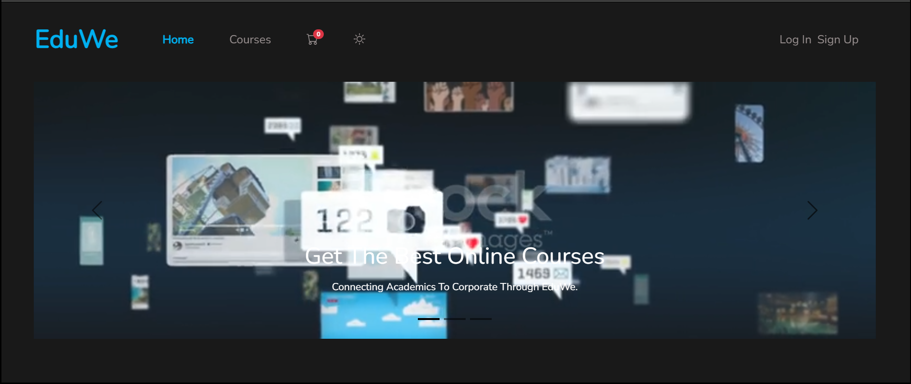
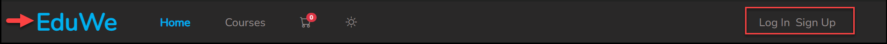
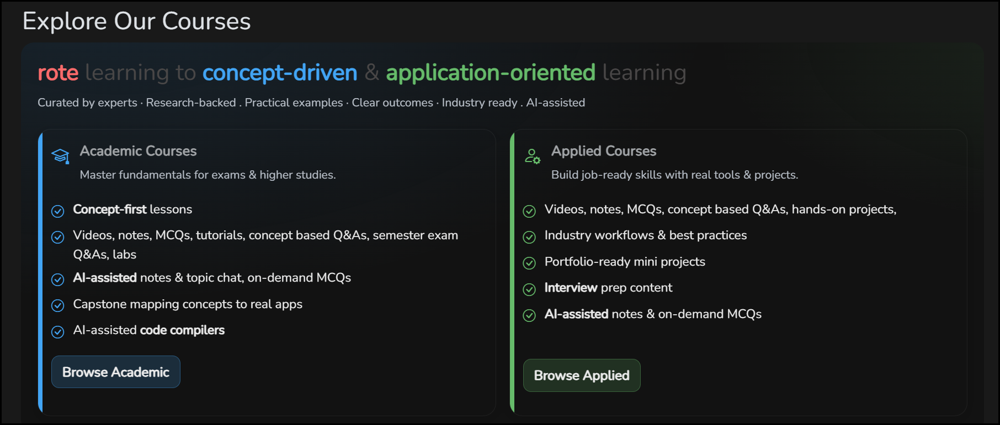
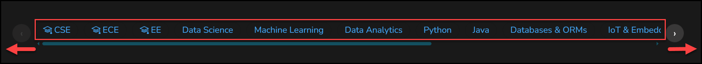
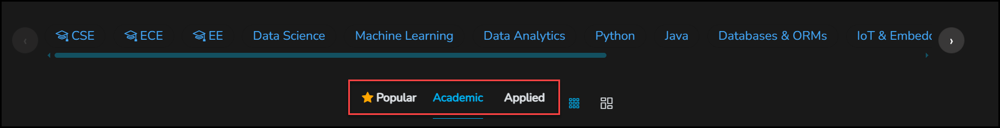
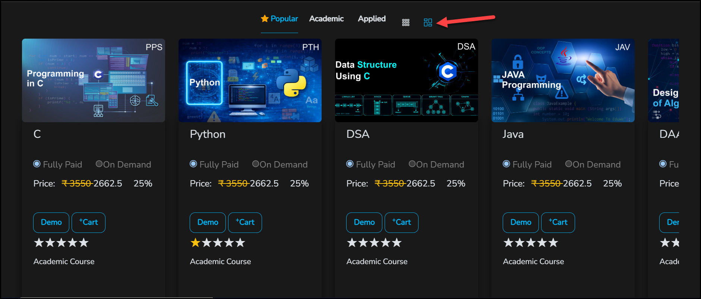
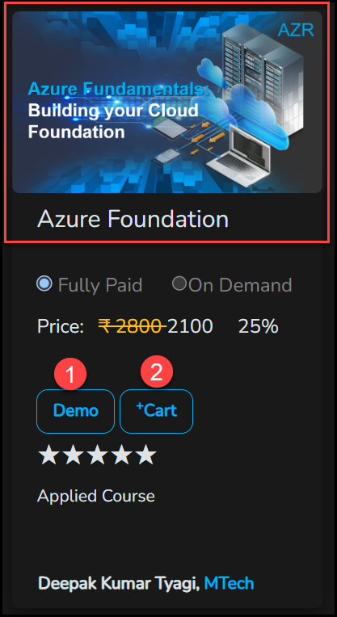
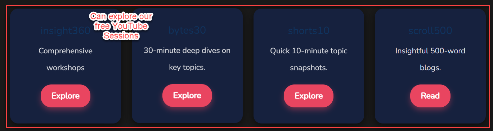
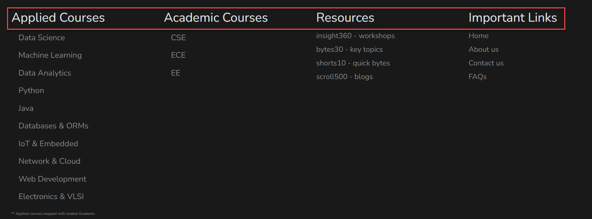

# Browse The Catalog

The eduwe.io home page is the course catalog. You can browse it, compare prices and open demos without logging in.

<figure markdown>
  { loading=lazy }
  <figcaption>The top of the EduWe home page.</figcaption>
</figure>

!!! tip "Take the guided tour"
    New to EduWe? Select **?** in the header, then **Take the tour**.

## The Top Of The Page

**Header.** From left to right, the header has the EduWe logo (it takes you back to the home page), the **Home** and **Courses** links, the cart icon, the theme toggle (the sun icon), and the **Log In** and **Sign Up** buttons. The number on the cart icon is how many courses are in your cart.

<!-- TODO: confirm what the Courses link opens (https://eduwe.io/courses returned 404 when checked). -->
<figure markdown>
  { loading=lazy }
  <figcaption>The header. The arrow points at the EduWe logo, and the box outlines the Log In and Sign Up buttons.</figcaption>
</figure>

**Banners.** Banners below the header introduce EduWe.

## Academic And Applied Courses

EduWe has two types of course. The **Explore Our Courses** section introduces them side by side.

- **Academic Courses.** Mapped to the curricula of various universities, to help you master fundamentals for exams and higher studies. They include concept-first lessons; videos, notes, MCQs, tutorials, concept-based Q&As, semester exam Q&As and labs; AI-assisted notes and topic chat with on-demand MCQs; a capstone that maps concepts to real applications; and AI-assisted code compilers. Select **Browse Academic** to see them.
- **Applied Courses.** Industry-oriented and built around real projects, to help you build job-ready skills with real tools. They are aligned with the Academic courses as well. They include videos, notes, MCQs, concept-based Q&As and hands-on projects; industry workflows and best practices; portfolio-ready mini projects; interview prep content; and AI-assisted notes with on-demand MCQs. Select **Browse Applied** to see them.

<!-- Source: eduwe.io home page, "Explore Our Courses" section, and product owner (Academic courses are mapped to various universities' curricula; Applied courses are industry-oriented with real projects and aligned with the Academic courses). -->
<!-- TODO: confirm whether the universities or curricula an Academic course maps to are named anywhere (for example on the course page), so learners can check their own syllabus. -->
<!-- TODO: confirm where the Browse Academic and Browse Applied buttons take you (the matching tab, or another page). -->
<!-- TODO: reconcile with taking-a-course.md#seqs: the product owner says CBSQs and SEQs only exist in Academic courses, but this eduwe.io marketing copy lists "concept-based Q&As" (CBSQs) under Applied Courses too. Confirm which is right and fix whichever page is wrong. -->
<figure markdown>
  { loading=lazy }
  <figcaption>The Explore Our Courses section.</figcaption>
</figure>

## Find A Course

- **Category strip.** Use the arrows or the scroll bar to move along the row of subjects. **CSE**, **ECE** and **EE** are Academic subjects. The others are Applied subjects: Data Science, Machine Learning, Data Analytics, Python, Java, Databases & ORMs, IoT & Embedded, Network & Cloud, Web Development and Electronics & VLSI.
- **Tabs.** Switch between **Popular**, **Academic** and **Applied**. **Academic** courses are mapped to university curricula and focus on fundamentals (concepts, proofs, exams). **Applied** courses are industry-oriented, built around real projects and aligned with the Academic courses.
- **Grid icons.** The two grid icons next to the tabs change how the courses are laid out.
    - **First icon** (the small dots): shows up to four courses in a single row.
    - **Second icon** (the larger squares): shows more courses than fit on the screen. Use the scroll bar below the course cards to move along the row and explore them.

<!-- Source: eduwe.io home page, home page footer and FAQ "Academic vs Applied". -->
<!-- TODO: describe what Popular shows and whether it is computed from enrolments or curated by an admin. In the grid screenshots it shows C, Python, DSA, Java and DAA, all labelled Academic Course. Confirm whether Popular can also include Applied courses. -->
<!-- TODO: confirm how a category selection filters the grid. -->
<!-- Source: product owner (up to four courses per row with the first icon; a scrolling row with the second icon). -->
<!-- TODO: confirm the grid icon labels or tooltips, and what happens with the first icon when there are more than four courses (more rows below, or a Load more button). -->

<figure markdown>
  { loading=lazy }
  <figcaption>Scroll the category strip to move through the subjects.</figcaption>
</figure>

<figure markdown>
  { loading=lazy }
  <figcaption>The tabs (outlined) and the two grid icons.</figcaption>
</figure>

<figure markdown>
  { loading=lazy }
  <figcaption>The first grid icon: up to four courses in a single row.</figcaption>
</figure>

<figure markdown>
  { loading=lazy }
  <figcaption>The second grid icon: a row you scroll sideways with the scroll bar below the cards. Part of the next course shows at the right edge.</figcaption>
</figure>

## Read A Course Card

Each course card shows:

- the course picture, with the **course code** in its top-right corner (for example AZR),
- the course title,
- the two payment options, **Fully Paid** and **On Demand**,
- the price: the original price crossed out, the price after the discount, and the discount percentage,
- a **Demo** button (1) and a **+Cart** button (2),
- a star rating, whether it is an Applied or Academic course, and the instructor.

Move the pointer over a card to see its details. They give a description and what the course includes: course video hours, tutorial video hours, pages of e-notes, MCQs, and questions and answers.

Every card offers a choice between **Fully Paid** and **On Demand**. See [Fully Paid vs On Demand](pricing-models.md) before you add a course to your cart.

<!-- TODO: the stars on the cards are mostly empty, and the Python card shows one gold star. Confirm whether the stars are the average of the ratings learners give with the Course Rating arrows on their dashboard. -->
<!-- TODO: the details open on hover. Confirm what touch-screen users (phones and tablets) do, since they cannot hover. -->
<figure markdown>
  { loading=lazy }
  <figcaption>A course card. (1) Demo. (2) +Cart.</figcaption>
</figure>

## More To Explore

Besides courses, the home page has four more kinds of content. Select **Explore** to open one, or **Read** for the blogs.

- **insight360.** Comprehensive workshops.
- **bytes30.** 30-minute deep dives on key topics.
- **shorts10.** Quick 10-minute topic snapshots.
- **scroll500.** Insightful 500-word blogs.

<!-- Source: eduwe.io home page. -->
<!-- TODO: the screenshot is annotated "Can explore our free YouTube Sessions". Confirm which of the four kinds are free or on YouTube, and whether any need an account. -->
<figure markdown>
  { loading=lazy }
  <figcaption>Workshops, key topics, quick bytes and blogs.</figcaption>
</figure>

## The Bottom Of The Page

The footer lists the courses again by type, under **Applied Courses** and **Academic Courses**. It also links to the **Resources** above (insight360, bytes30, shorts10 and scroll500) and to **Important Links**: Home, About us, Contact us and FAQs. See the [FAQ](../support/faq.md) and [Contact](../support/contact.md) pages.

<!-- TODO: the live footer also lists Terms & Conditions, Register and Privacy, and contact details, which are not in the current screenshot. Confirm and re-capture if they should be shown. -->
<figure markdown>
  { loading=lazy }
  <figcaption>The footer.</figcaption>
</figure>

## Next Steps

- [Understand course codes](course-codes.md)
- [Watch a demo](watch-a-demo.md)
- [Add to cart and check out](cart-and-checkout.md)
