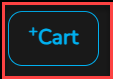
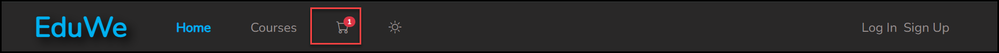
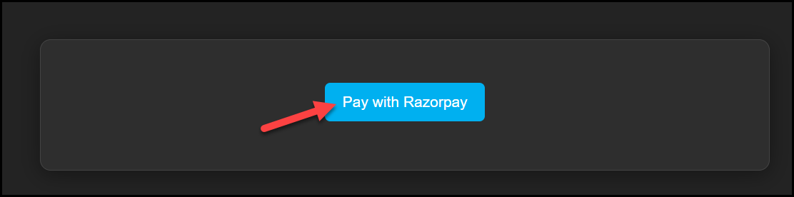
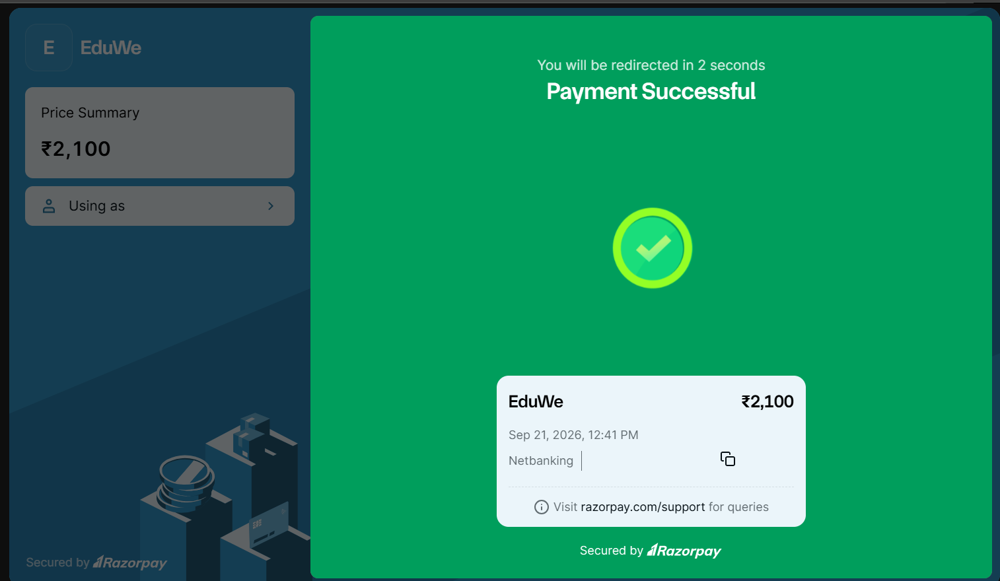
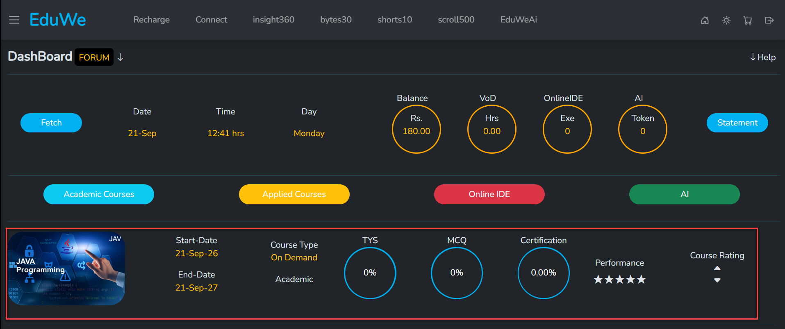

# Cart And Checkout

## Add To Cart

On a course card, choose **Fully Paid** or **On Demand**, then select **+Cart**. The course is added to your shopping cart, and the cart icon in the header shows how many courses are in it, so you can move on to check out whenever you are ready.

You cannot switch between Fully Paid and On Demand after you buy a course, so check the option before you check out.

<figure markdown>
  { loading=lazy }
  <figcaption>The +Cart button.</figcaption>
</figure>

<figure markdown>
  { loading=lazy }
  <figcaption>The header cart icon, showing 1 course added.</figcaption>
</figure>

<!-- TODO: confirm behaviour when the same course is added twice. -->
<!-- TODO: the cart shows the option as plain text (for example "Fully Paid"). Confirm it cannot be changed in the cart, so a learner has to remove the course and add it again to change it. -->

## Review Your Cart

Open your cart from the cart icon in the header. The **Shopping cart** page shows how many items are in it and lists each course you added. **Sort by** changes the order of the list.

Each course shows:

- the course picture, title and instructor,
- the option you chose, **Fully Paid** or **On Demand**,
- the discount percentage, the original price crossed out, and the price after the discount,
- a trash icon to remove the course from the cart.

**Continue shopping** (top left) and **Shop More** (in the summary) let you go back and add more courses.

## Check Out

1. Check each course and the option you chose. You cannot switch after you buy.
2. If you have a coupon, type it in **Enter Coupon Code**.
3. Check the **Cart Summary**. It shows the **Subtotal** (the price before discount), the **Discount**, and the **Total (Incl. taxes)**.
4. Select **Check Out**. If you are not logged in, EduWe opens the **Log In** screen. Log in if you have an account, or select **Sign Up** if you have not signed up yet. See [Log in](../getting-started/log-in.md) and [Create an account](../getting-started/create-account.md).

<!-- Source: eduwe.io shopping cart screenshot (cart-01-shopping-cart.png). -->
<figure markdown>
  { loading=lazy }
  <figcaption>The shopping cart. The red box outlines the Check Out button.</figcaption>
</figure>

<!-- Source: product owner (Check Out asks you to Sign Up if you have not signed up); eduwe.io Log In screen. -->
<figure markdown>
  { loading=lazy }
  <figcaption>If you are not logged in, Check Out opens this screen. Log in on the left, or select Sign Up on the right.</figcaption>
</figure>

<!-- TODO: confirm the cart icon opens this page, and note its route (app_route above). -->
<!-- TODO: coupons: how a code is applied (Enter key or a button), what the summary shows after it is applied, and what message appears for an invalid or expired code. -->
<!-- TODO: confirm the cart is kept after logging in or signing up, and whether you land back in checkout afterwards. -->
<!-- TODO: document the steps after logging in: payment methods, the confirmation screen, and invoices. Requires walking a purchase. -->
<!-- TODO: add a cart screenshot with an On Demand course, and document how the recharge system appears at checkout for On Demand. -->
<!-- TODO: the Sort by options (the screenshot shows Name). -->

## Pay With Razorpay

After you select **Check Out** and log in, select **Pay with Razorpay**.

<figure markdown>
  { loading=lazy }
  <figcaption>Select Pay with Razorpay.</figcaption>
</figure>

EduWe payments are handled by Razorpay. In the **Payment Options** window:

- The left side shows the **Price Summary**, which is the amount you pay, and the mobile number you are paying with.
- Choose how to pay: **UPI**, **Cards**, **Netbanking** or **Wallet**.
- With **UPI**, scan the **UPI QR** with any UPI app. A countdown timer is shown next to the QR.

<figure markdown>
  { loading=lazy }
  <figcaption>The Payment Options window. The phone number and the QR code are hidden in this picture.</figcaption>
</figure>

<!-- Source: eduwe.io purchase walkthrough (cart-02, cart-03 and cart-04 screenshots). Personal details are hidden in the pictures: phone number, payment ID and the UPI QR code. -->
<!-- TODO: confirm what the page before the Pay with Razorpay button shows (the screenshot only shows the button), and whether any other step comes first. -->
<!-- TODO: confirm where the mobile number after "Using as" comes from (the EduWe account or Razorpay) and whether the arrow beside it lets you change it. -->
<!-- TODO: list the banks and wallets offered, and how long the UPI QR stays valid (the screenshot shows a countdown timer). -->
<!-- TODO: document what happens if a payment fails, is cancelled, or the QR expires, and whether the cart is kept. -->

## After You Pay

When your payment goes through, you see **Payment Successful**. The screen shows the amount, the date and time, how you paid, and a payment ID that you can copy. It says **You will be redirected in 2 seconds**, and then you land on your learner dashboard, where your new course appears. See [Your dashboard](../getting-started/dashboard.md).

<figure markdown>
  { loading=lazy }
  <figcaption>The Payment Successful screen. The phone number and the payment ID are hidden in this picture.</figcaption>
</figure>

For payment queries, the screen points to razorpay.com/support.

<!-- TODO: decide whether learners should contact Razorpay support or EduWe support (info@ceekh.com) about a payment, or should register a complaint with Connect, and say so here. -->
<!-- TODO: confirm whether a receipt or invoice is emailed or available to download after payment. -->

**Your course is added to your dashboard.** After a successful payment, the course you bought is added to your learner dashboard, and you land there automatically after the redirect. Each course you buy gets its own row, which shows its Start-Date and End-Date, whether it is Fully Paid or On Demand, and your progress. See [Your dashboard](../getting-started/dashboard.md).

<figure markdown>
  { loading=lazy }
  <figcaption>Your learner dashboard. The red box outlines the row of a course that was added after payment.</figcaption>
</figure>

<!-- Source: product owner (after a successful payment the course is added to the learner dashboard) and the dashboard screenshot. -->
<!-- TODO: confirm how quickly the course appears on the dashboard, and what a learner should do if the payment succeeded but the course is not there (contact support, wait, refresh). -->

A course cannot be refunded once purchased. See [Fully Paid vs On Demand](pricing-models.md) for what applies to every course, and [Contact](../support/contact.md) if something goes wrong.
