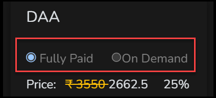
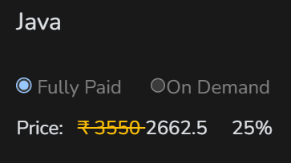
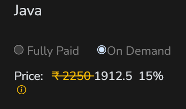
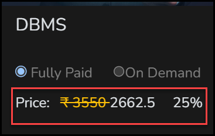

# Fully Paid Vs On Demand

Every course card lets you choose between **Fully Paid** and **On Demand** before you add the course to your cart. Each option has its own price and discount, and it changes how you get access to the course.

!!! warning "Decide before you buy"
    You cannot switch between Fully Paid and On Demand after you buy a course. Choose the option you want before you check out.

<figure markdown>
  { loading=lazy }
  <figcaption>Choose Fully Paid or On Demand on the card.</figcaption>
</figure>

## The Two Options

- **Fully Paid.** You pay the Fully Paid price and unlock the whole course at once.
- **On Demand.** It has its own price. The **recharge system** applies when you buy the course, and you use the course according to your requirement. You recharge your account with **Recharge** in the top bar of your dashboard, and the minimum is Rs. 100. The same money is also used by EduWeAi to give you AI tokens. See [Recharge your account](../getting-started/dashboard.md#recharge-your-account).

<!-- Source: product owner (the recharge system applies when buying On Demand; prices differ by option, shown in the Java screenshots). The "unlocks the whole course at once" wording for Fully Paid comes from the spec draft; confirm it. -->
<!--
  TODO (highest priority page, do not publish until filled): describe how the recharge system works. Needed:
  (how to top up and the Rs. 100 minimum are now on the dashboard page) what else a recharge is spent on beyond On Demand courses and EduWeAi tokens (the eduwe.io FAQ
  says video minutes, online compilers and AI queries are metered on pay-as-you-go), whether unused balance expires,
  where you see your balance, and what happens when it runs out.
  Also document the text behind the (i) information icon next to the On Demand price.
  Observed on the learner dashboard: a Recharge link; Balance (Rs.), VoD (Hrs), OnlineIDE (Exe) and AI (Token) counters; and an
  On Demand course with Start-Date 21-Sep-26 and End-Date 21-Sep-27 (one year). Confirm these are what a recharge covers and
  that On Demand access is one year, then fill the table above.
  Also confirm how the recharge relates to the course price (is the price paid in full up front, or spread across recharges?),
  the On Demand access period, and whether the certificate conditions are the same for On Demand.
-->

## Side By Side

| | Fully Paid | On Demand |
|---|---|---|
| Course price | Its own price. Java: ₹3550 crossed out, 25% off, 2662.5 | Its own price. Java: ₹2250 crossed out, 15% off, 1912.5 |
| How you get access | The whole course at once | Through recharges, according to your requirement |
| Recharge system | Not applicable | Applies when you buy the course. Minimum recharge: Rs. 100 |
| What a recharge covers | Not applicable | Your use of On Demand courses, and EduWeAi tokens |
| Access period | One year from the day you subscribe | <!-- TODO --> |
| Certificate | Yes, once you complete the course and meet the certification conditions. See [Certificates](certificates.md) | <!-- TODO --> |
| Switching after you buy | Not possible | Not possible |

<!-- Source: product owner (Fully Paid access is one year; certificate after completing the course with the conditions on the Certificates page; no switching after buying). "From the day you subscribe" is from the eduwe.io FAQ. -->

## From The eduwe.io FAQ

The eduwe.io FAQ describes two pricing approaches, which line up with these two options:

- **Fixed price.** One upfront price that includes core material and video access. Online compilers and AI (LLM) usage stay pay-as-you-use.
- **Pay-as-you-go.** You pay for what you use. Video minutes, online compilers and AI (LLM) queries are metered. Core materials (notes, tutorials, MCQs and concept-based short Q&As) are included when you subscribe.

Your dashboard shows real-time usage and spend.

<!-- Source: eduwe.io FAQ "How does pricing work?" and "What's included in fixed price vs pay-as-you-go?" -->
<!-- TODO: confirm that Fixed price is Fully Paid and Pay-as-you-go is On Demand, then merge this section into the table above and use the card's own labels. -->

## Things That Apply To Every Course

- **No switching.** You cannot switch between Fully Paid and On Demand after buying a course, so decide in advance which one you need.
- **Refunds.** A course cannot be refunded once purchased. For any issue, contact [info@ceekh.com](mailto:info@ceekh.com).

<!-- Source: product owner (no switching); eduwe.io FAQ "What is your refund policy?" -->
<!-- TODO: confirm the refund rule applies to both options, including money added through a recharge. -->

## Prices And Discounts

Each card shows the price for the option you have selected: the original price crossed out, the price after the discount, and the discount percentage. Select the other option to see its price. The prices are different in the two options.

For example, the Java course shows this for each option:

<figure markdown>
  { loading=lazy }
  <figcaption>Fully Paid: ₹3550 crossed out, 2662.5 after 25% off.</figcaption>
</figure>

<figure markdown>
  { loading=lazy }
  <figcaption>On Demand: ₹2250 crossed out, 1912.5 after 15% off. A small information icon appears below the price.</figcaption>
</figure>

<figure markdown>
  { loading=lazy }
  <figcaption>The price line on a card: the original price (crossed out), the discounted price and the discount percentage.</figcaption>
</figure>

<!-- TODO: the cart total is labelled "Total (Incl. taxes)". Confirm the prices on the course cards are also tax-inclusive, and how GST appears on the invoice. -->
<!-- TODO: 25% (Fully Paid) and 15% (On Demand) were seen on the cards checked (Java, DAA, DBMS, Azure Foundation). Confirm whether each option always has a fixed discount, or whether it varies by course or campaign, and whether the original prices differ per course. -->
<!-- TODO: document what the (i) icon under the On Demand price says. -->

## Which Should I Choose?

- Choose **Fully Paid** if you want the whole course available at once, with one year of access.
- Choose **On Demand** if you want to access the course according to your requirement, using recharges.

You cannot switch after you buy, so decide in advance.

<!-- TODO: expand this once the recharge details above are filled, for example with an example of a learner who fits each option. -->

Next: [Add to cart and check out](cart-and-checkout.md).
