# Taking A Course

Courses run in your browser, so you do not need to install anything. A modern browser and a stable internet connection are recommended.

## Opening A Course

On your [dashboard](../getting-started/dashboard.md), click any course row (or its picture) to open that course's home page.

<figure markdown>
  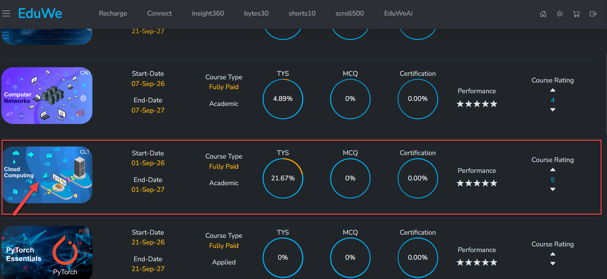{ loading=lazy }
  <figcaption>Click a course row on your dashboard to open it.</figcaption>
</figure>

## The Course Home Page

The course home page is what opens. It has two fixed parts and a main area that changes with the tab you pick:

- A **sidebar** on the left showing the course code (for example `CLT 1115`) and its chapter list. Each chapter expands to show its topics.
- A **tab bar** across the top: **Videos**, **Notes**, **Tutorials**, **MCQs**, **CBSQs**, **SEQs**, **Labs**, **Projects** and **My Notes**. Videos is selected by default.

<figure markdown>
  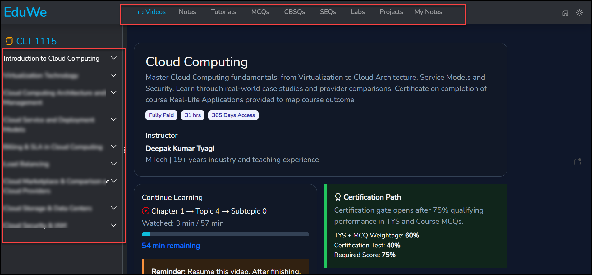{ loading=lazy }
  <figcaption>The course home page for Cloud Computing (course code CLT 1115).</figcaption>
</figure>

<!-- Source: eduwe-app screenshots of the Cloud Computing course home page and dashboard. -->

## Course Tabs

Each tab shows a different kind of content for the chapter, topic and subtopic you pick in the sidebar.

### Videos

All of a course's videos are here. Select the **Videos** tab (1), then pick a **Chapter** (2) and its **Topic** (3) in the sidebar to open the video player and press play (4).

<figure markdown>
  { loading=lazy }
  <figcaption>Playing a topic's video. Below the player, three buttons switch to other views for the same topic.</figcaption>
</figure>

Below the player, three buttons let you switch views without leaving the topic:

- The **blue book icon** opens that topic's notes right there, so you do not need to switch to the separate **Notes** tab to read them.
- The **yellow robot icon** opens EduWeAi in a panel beside the video, scoped to whatever topic is currently open:
    - **Tutor** explains the topic out loud. Pick the language (Hindi or English) and a voice.
    - **Chat** lets you chat with EduWeAi about the current topic.
    - **Notes** lets you ask EduWeAi about the notes, and view a summary of the paused video frame.

  Everything in this panel stays restricted to the video you have open; it does not answer outside that topic.
- The **red script icon** opens the topic's full lecture script as text, so you can read along with (or instead of) watching the video.

<figure markdown>
  { loading=lazy }
  <figcaption>EduWeAi opened from the Videos tab, scoped to the topic currently playing.</figcaption>
</figure>

<figure markdown>
  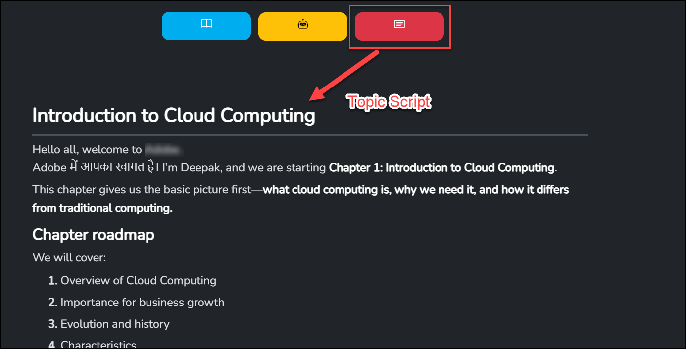{ loading=lazy }
  <figcaption>The full lecture script for a topic, opened with the red script icon.</figcaption>
</figure>

Videos is also the tab selected by default when you open a course, so its main area additionally shows:

- **The course header.** Title, a short description, and badges for the course type (Fully Paid or On Demand), its total duration in hours, and its access period (for example 365 Days Access).
- **Instructor.** Name and a short line of qualification and experience.
- **Continue Learning.** Where you left off, as Chapter → Topic → Subtopic, with the time watched out of the video's total length, a progress bar, and the time remaining. A reminder banner also appears here.
- **Certification Path.** A summary of how you earn a certificate for this course: the gate opens once you reach a qualifying performance in TYS and the course MCQs, and the weighting between that and the certification test. See [Certificates](certificates.md) for the full breakdown.

<!-- TODO: confirm the exact wording and behaviour of the "Reminder: Resume this video..." banner (cut off in the source screenshot). -->
<!-- TODO: confirm whether the course header's badges (course type, hours, access period) match the pricing model exactly for On Demand courses too. -->
<!-- TODO: confirm whether the course header/instructor/Continue Learning/Certification Path block stays visible once you switch away from Videos to another tab. -->

### Notes

Select the **Notes** tab, then pick a **Chapter**, **Topic** and **Subtopic** in the sidebar to read its notes. Notes include diagrams wherever the topic needs one.

<figure markdown>
  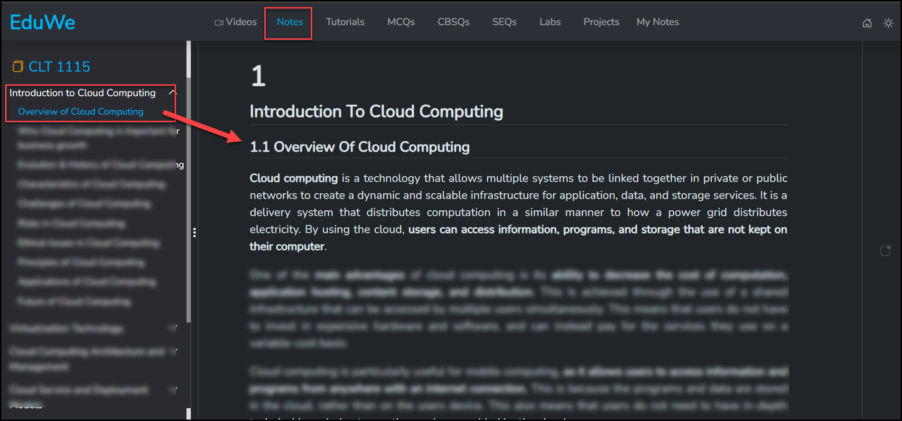{ loading=lazy }
  <figcaption>The Notes tab, open on the Overview of Cloud Computing topic.</figcaption>
</figure>

<!-- TODO: confirm whether these are written course notes, distinct from the AI-generated notes under EduWeAi's Notes tool. -->

#### TYS

Some chapters end with a **TYS** button in their notes, below the chapter summary. Instructors add TYS to a chapter as needed, so not every chapter has one.

<figure markdown>
  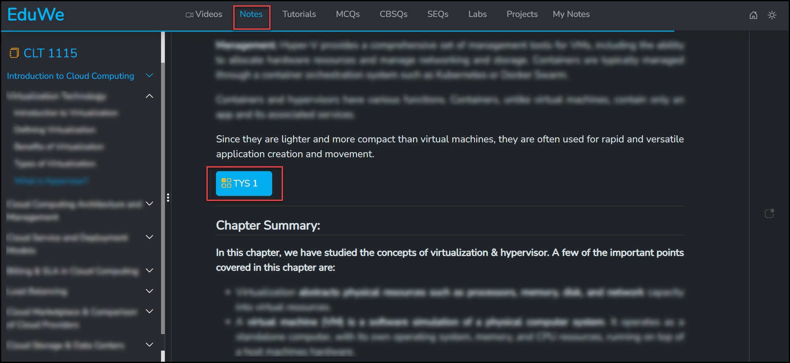{ loading=lazy }
  <figcaption>A TYS button at the end of a chapter's notes.</figcaption>
</figure>

TYS opens a set of MCQ-style questions for that chapter. Submit your answers, and your result feeds the **TYS** progress circle for the course on your [dashboard](../getting-started/dashboard.md#tys-and-mcq-what-you-have-attempted).

<figure markdown>
  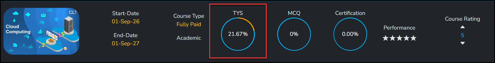{ loading=lazy }
  <figcaption>TYS results show up as this progress circle on your dashboard.</figcaption>
</figure>

Your TYS performance also counts toward earning the course's certificate. See [Certificates](certificates.md).

<!-- TODO: confirm TYS attempt rules: one attempt or retakes, time limit, and whether the dashboard circle shows percentage attempted or percentage correct. -->
<!-- TODO: confirm whether TYS also appears under other tabs (for example Tutorials) or only at the end of chapter notes. -->

### Tutorials

Select the **Tutorials** tab, then pick a **Chapter** in the sidebar to work through that chapter's tutorials: tutorial videos and tutorial notes, presented as scenarios with questions and their answers.

<figure markdown>
  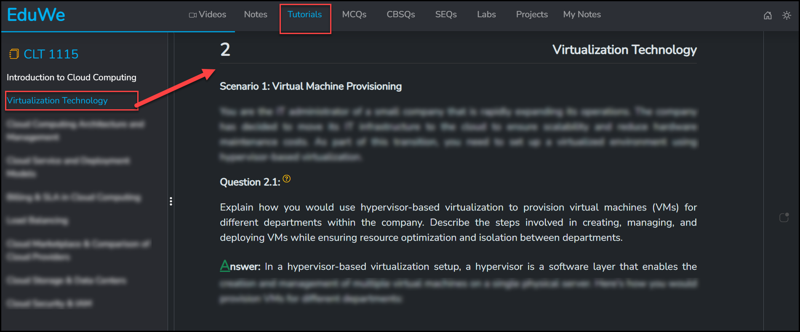{ loading=lazy }
  <figcaption>The Tutorials tab, working through a chapter's scenario-based questions and answers.</figcaption>
</figure>

<!-- TODO: confirm how the tutorial video and tutorial notes formats are presented together or switched between on this tab. -->

### MCQs

Select the **MCQs** tab (1), then pick a **Chapter** in the sidebar (2). Two kinds of MCQs are available for the chapter:

- **Test MCQs.** Click **Test MCQs** (3) to start a graded set of questions, one at a time, with **Previous**, **Submit** and **Next** buttons.
- **Practice MCQs.** Listed directly under the chapter, one after another, to practise without starting a test.

<figure markdown>
  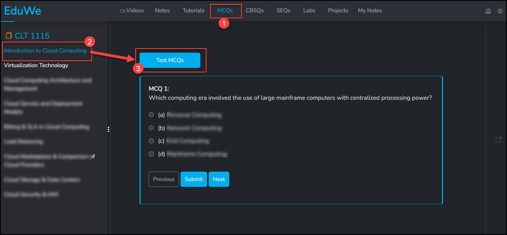{ loading=lazy }
  <figcaption>Test MCQs for a chapter, opened with the Test MCQs button.</figcaption>
</figure>

<figure markdown>
  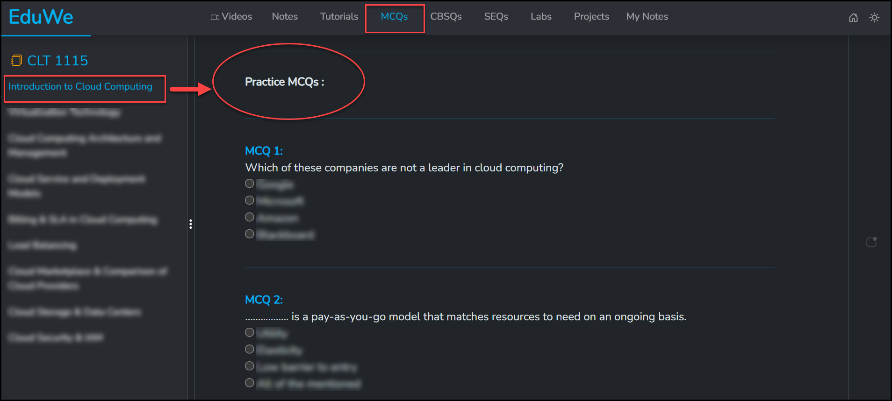{ loading=lazy }
  <figcaption>Practice MCQs for the same chapter, listed without needing a Test MCQs button.</figcaption>
</figure>

Submit the correct answers in a Test MCQs set, and your result feeds the **MCQ** progress circle for the course on your [dashboard](../getting-started/dashboard.md#tys-and-mcq-what-you-have-attempted), the same way TYS does. It also counts toward earning the course's certificate. See [Certificates](certificates.md).

<figure markdown>
  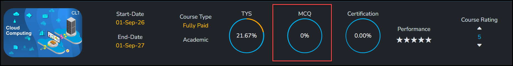{ loading=lazy }
  <figcaption>Test MCQ results show up as this progress circle on your dashboard.</figcaption>
</figure>

<!-- TODO: confirm whether Practice MCQs also feed the dashboard's MCQ circle, or only Test MCQs do. -->
<!-- TODO: confirm MCQ attempt rules: retakes, time limit, and whether the dashboard circle shows percentage attempted or percentage correct. -->

### CBSQs

**CBSQ** stands for **Concept Based Short Questions**. Select the **CBSQs** tab (1), then pick a **Chapter** in the sidebar (2) to read its instructor-written short questions and answers, meant to strengthen your understanding of the chapter's concepts.

<figure markdown>
  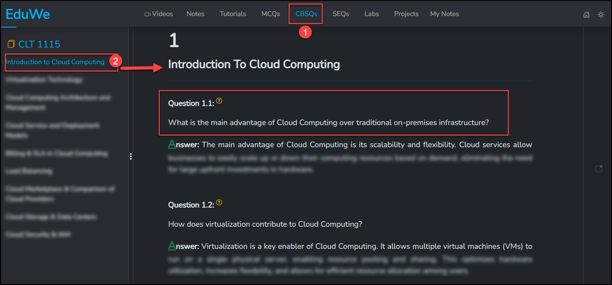{ loading=lazy }
  <figcaption>The CBSQs tab, working through a chapter's concept-based short questions.</figcaption>
</figure>

### SEQs

**SEQ** stands for **Semester End Questions**. Select the **SEQs** tab (1), then pick a **Chapter** in the sidebar (2) to read its long-form question-and-answer content, written to the pattern of various universities' exams, to help you prepare for your end-semester exam.

<figure markdown>
  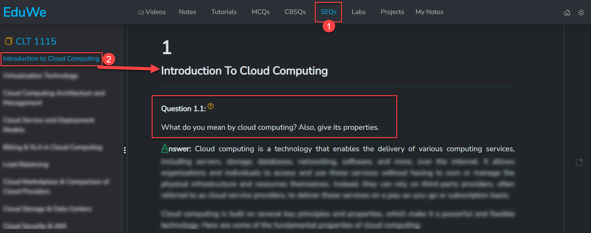{ loading=lazy }
  <figcaption>The SEQs tab, working through a chapter's semester-end style questions.</figcaption>
</figure>

!!! note "CBSQs And SEQs Are Academic Only"
    CBSQs and SEQs are only available in Academic courses, not in Applied courses.

### Labs

Labs are only available in Academic courses. Select the **Labs** tab (1), then pick a **Chapter** in the sidebar (2). A topic can have more than one lab, so pick the one you want with its **Lab 1**, **Lab 2**, **Lab 3**, and so on buttons (3). Each lab is an experiment, with its questions and their solutions, to help you understand the chapter through practical, hands-on learning.

<figure markdown>
  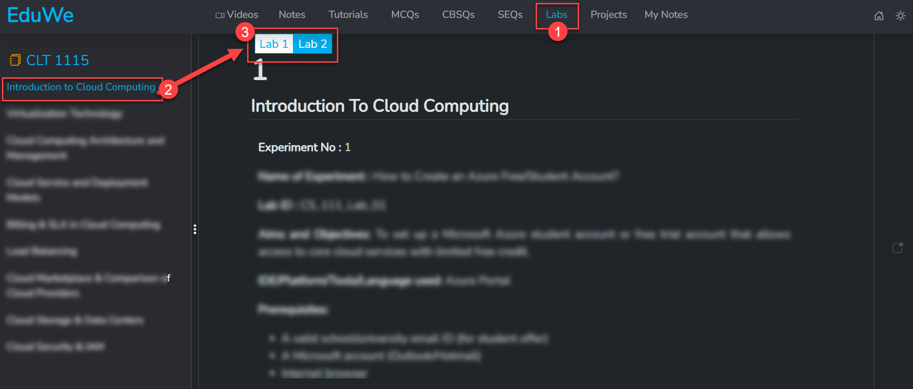{ loading=lazy }
  <figcaption>The Labs tab, open on Lab 1 of a chapter with more than one lab.</figcaption>
</figure>

!!! note "Labs Are Academic Only"
    Labs are only available in Academic courses, not in Applied courses.

### Projects

Select the **Projects** tab (1). This is where a course's guided, portfolio-ready capstone project lives: a real-world project, written by the instructor, that almost every course has.

The sidebar (2) lists the project's overview and its parts — for example, a project called "Modernizing Admant Inc.'s Training Platform with Microsoft Azure" broken into parts like "Initial Infrastructure Setup", "Scaling and Load Balancing" and "Global Expansion with a Content Delivery Network (CDN)". Each part has its own video; scroll down below the video for that part's project notes.

<figure markdown>
  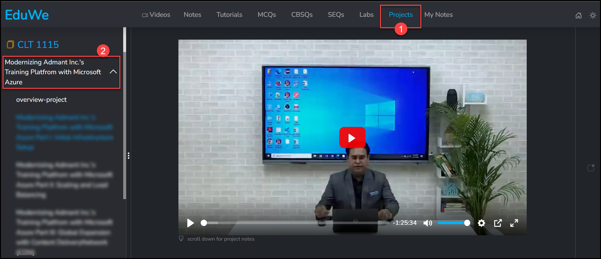{ loading=lazy }
  <figcaption>The Projects tab, playing a project's overview video.</figcaption>
</figure>

Working through the project is implementation-based learning: instead of just reading or watching, you build the project yourself, which strengthens the skills the course teaches.

<!-- TODO: confirm whether the project is graded, and whether it counts toward the certificate the same way TYS and MCQs do. -->

### My Notes

Select the **My Notes** tab to write and store your own notes as you explore a course. Choose a **Course** (1), **Chapter** (2) and **Topic** (3) to file the note under, write it in the Note Editor (it has a formatting toolbar, and a 50 KB limit per note), then **Save** it. Come back to **Read** (4) it later, from the same course or from any other.

<figure markdown>
  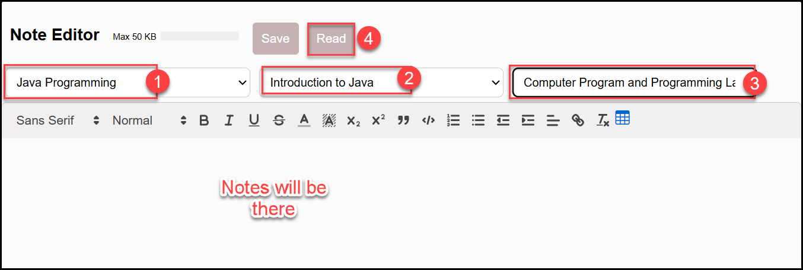{ loading=lazy }
  <figcaption>The My Notes tab, the Note Editor, ready for a new note.</figcaption>
</figure>

This is the same Note Editor as the **My Notes** tool under [EduWeAi on your dashboard](../getting-started/dashboard.md#my-notes); it opens here too so you can save a note without leaving the course you are in.

## AI Assistance

Inside a course you also have access to AI assistance to generate notes and MCQs and to get help on a topic. See [EduWeAi](../getting-started/dashboard.md#eduweai).

Related: [Quizzes and assignments](quizzes-and-assignments.md), [Certificates](certificates.md).
