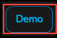
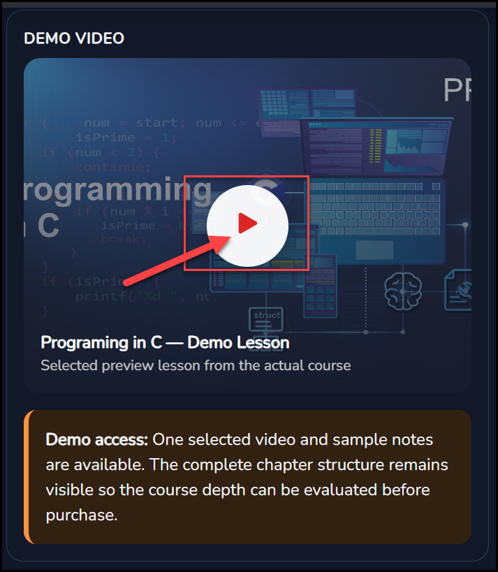
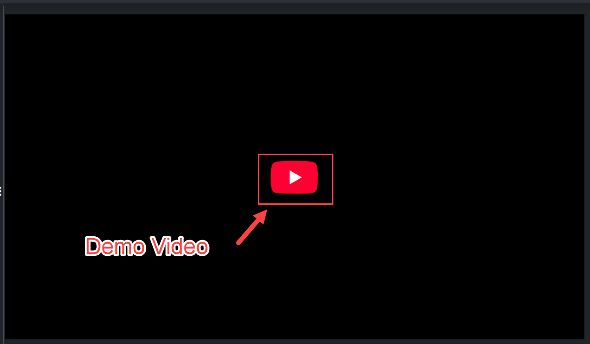

# Watch A Demo

Each course card has a **Demo** button. When you want to explore a course, select **Demo**. It takes you to the course demo page, where you can preview the course before you decide.

<figure markdown>
  { loading=lazy }
  <figcaption>The Demo button.</figcaption>
</figure>

## The Course Demo Page

A **Demo Course Preview** badge sits above the course title, so you know you are looking at a preview.

<figure markdown>
  { loading=lazy }
  <figcaption>The course demo page. The red box outlines the Demo Course Preview badge.</figcaption>
</figure>

- **Chapters.** The left side shows the course code, for example **PPS 1101**, and the chapters of the course. Each chapter has a down arrow.
- **Top bar.** It has **Videos**, **Notes**, **Tutorials**, **MCQs**, **CBSQs**, **SEQs**, **Labs** and **Projects**.
- **Course details.** The page shows the course title, a short description, the tags **Structured Learning**, **12 Months Access** and **Certificate Included**, and the instructor's name and short profile.
- **Video learning preview.** A panel explains the video learning. You can watch topic-wise lessons, pause at difficult points, and use the AI Video Tutor to ask questions, clarify concepts, create notes and continue topic-focused discussions.

## Watch The Demo Video

Find the **Demo Video** panel and select the play button. The panel is called a demo lesson, and it says it is a selected preview lesson from the actual course.

<figure markdown>
  { loading=lazy }
  <figcaption>The Demo Video panel. Select the play button.</figcaption>
</figure>

The video then opens in a player. Select the play button in the player to watch it.

<figure markdown>
  { loading=lazy }
  <figcaption>The demo video player.</figcaption>
</figure>

## What The Demo Includes

One selected video and sample notes are available. The complete chapter structure stays visible, so you can judge how deep the course is before you buy.

<!-- Source: product owner (a new learner selects Demo and goes to the course demo page) and the demo screenshots (demo-01, demo-02 and demo-03). The Demo access wording is from the demo page itself. -->
<!-- TODO: confirm whether the demo page opens without an account. The Browse The Catalog and Create An Account pages currently say demos can be opened without logging in. Also note the demo page route. -->
<!-- TODO: explain how to open the sample notes (the Notes tab?), and what the other top-bar tabs (Tutorials, MCQs, CBSQs, SEQs, Labs, Projects) show on a demo. Spell out CBSQs and SEQs. -->
<!-- TODO: explain how to use the AI Video Tutor in a demo, and whether it uses AI tokens. -->
<!-- TODO: the 12 Months Access tag matches the one-year access rule. Confirm it applies to both Fully Paid and On Demand. -->
<!-- TODO: how long is the demo video, and what happens when it ends (is there a Buy or Add To Cart button on the demo page)? -->
<!-- NOTE FOR THE APP TEAM: the demo page title reads "Programing in C" (one m), while the catalog says "Programming in C". -->

Ready to buy? See [Cart And Checkout](cart-and-checkout.md). Back to [Browse The Catalog](browse-catalog.md).
